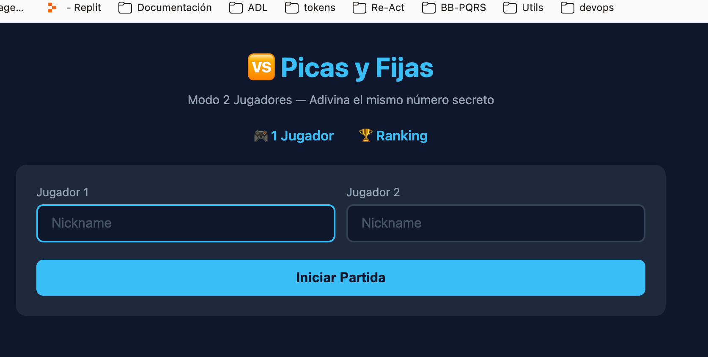

# 🎯 Picas y Fijas

Implementación del clásico juego de **Picas y Fijas** (Bulls and Cows) usando **Arquitectura Hexagonal** en TypeScript.

El jugador debe adivinar un número secreto de 4 dígitos únicos. Tras cada intento recibe:

- **Fijas**: dígitos correctos en la posición correcta.
- **Picas**: dígitos correctos en una posición incorrecta.

---

## 📐 Arquitectura

El proyecto sigue los principios de **Arquitectura Hexagonal (Ports & Adapters)**, separando claramente dominio, aplicación e infraestructura.

```
src/
├── game/                          # Módulo: Partida single-player y multi-player
│   ├── domain/entities/           # SinglePlayerGame, MultiPlayerGame
│   ├── application/
│   │   ├── ports/                 # SinglePlayerGameRepository, MultiPlayerGameRepository
│   │   ├── use-cases/             # StartSinglePlayerGame, MakeGuessInGame,
│   │   │                          # GetGameStatus, GetSinglePlayerRanking,
│   │   │                          # StartMultiPlayerGame, MakeGuessInMultiPlayerGame,
│   │   │                          # GetMultiPlayerGameStatus
│   │   ├── dto/                   # SinglePlayerGameDTO, MultiPlayerGameDTO,
│   │   │                          # SinglePlayerRankingElementDTO
│   │   └── mappers/               # SinglePlayerGameMapper, MultiPlayerGameMapper
│   └── infrastructure/
│       ├── input/                 # ExpressGameAdapter, ConsoleGameAdapter,
│       │                          # ConsoleMultiPlayerAdapter, BrowserGameAdapter
│       └── output/                # FileSystem, MySQL, LocalStorage repos
│
├── trivia/                        # Módulo: Trivia (lógica del acertijo)
│   ├── domain/
│   │   ├── entities/              # Trivia
│   │   └── value_objects/         # SecretNumber, Guess, GuessResult
│   ├── application/
│   │   ├── ports/                 # TriviaRepository
│   │   ├── use-cases/             # CreateTrivia, MakeGuess, GetTriviaSummary
│   │   └── dto/                   # TriviaDTO
│   └── infrastructure/output/     # FileSystem, MySQL, LocalStorage repos
│
├── player/                        # Módulo: Jugador
│   ├── domain/
│   │   ├── entities/              # Player
│   │   └── value_objects/         # Nickname
│   ├── application/
│   │   ├── ports/                 # IPlayerRepository
│   │   └── use-cases/             # GetOrCreatePlayer
│   └── infrastructure/output/     # FileSystem, MySQL, LocalStorage repos
│
└── shared/                        # Módulo: Compartido
    ├── application/ports/         # IdProvider, SecretProvider
    └── infrastructure/output/     # UuidV4IdProvider, DotEnvSecretProvider,
                                   # MySqlConnectionPool
```

### Capas

| Capa | Responsabilidad |
|---|---|
| **Dominio** | Entidades (`Trivia`, `Player`, `SinglePlayerGame`), Value Objects (`SecretNumber`, `Guess`, `GuessResult`, `Nickname`, `GameState`) y reglas de negocio. Sin dependencias externas. |
| **Aplicación** | Casos de uso, DTOs, mappers y **puertos** (interfaces). Orquesta la lógica de dominio. |
| **Infraestructura** | **Adaptadores de entrada** (Express, Consola, Browser) y **adaptadores de salida** (FileSystem, MySQL, LocalStorage). Implementan los puertos. |

### Puertos (Interfaces)

| Puerto | Métodos |
|---|---|
| `SinglePlayerGameRepository` | `save()`, `findById()`, `findAll()` |
| `TriviaRepository` | `save()`, `findById()` |
| `IPlayerRepository` | `save()`, `findById()`, `findByNickname()` |
| `IdProvider` | `generate()` |
| `SecretProvider` | `get(key)` |

### Adaptadores de Salida (Repositorios)

| Estrategia | Uso | Configuración |
|---|---|---|
| **FileSystem** | Desarrollo local | `ENV=DEV` (por defecto) |
| **MySQL** | Producción | `ENV=PROD` + Docker/MySQL |
| **LocalStorage** | Navegador (bundle) | Frontend standalone |

---

## 🚀 Inicio Rápido

### Prerrequisitos

- Node.js 18+
- npm
- Docker y Docker Compose (solo para MySQL)

### Instalación

```bash
npm install
```

### Modos de Ejecución

El proyecto ofrece **3 adaptadores de entrada** diferentes:

#### 1. Consola (CLI)

```bash
npm run start-console
```

Juego interactivo por terminal. Usa repositorios FileSystem (`./data/`).

#### 2. API HTTP (Express)

```bash
npm run start-http
```

Levanta la API REST en `http://localhost:3000`. Por defecto usa FileSystem.

#### 3. Frontend en Navegador

```bash
# Opción A: Frontend que consume la API Express
npm run start-www

# Opción B: Frontend standalone con LocalStorage
npm run build-front && npm run start-front
```

- **Opción A** (`start-www`): Sirve `www/` en el puerto 8080. Requiere la API corriendo en el puerto 3000.
- **Opción B** (`build-front` + `start-front`): Empaqueta todo en `public/bundle.js` y sirve `public/` en el puerto 8080. No requiere API, usa LocalStorage.

---

## 🗄️ Base de Datos (MySQL)

Para usar MySQL como persistencia:

### 1. Levantar MySQL con Docker

```bash
docker-compose up -d
```

Esto crea un contenedor MySQL 8.0 con:
- **Base de datos**: `picasyfijas`
- **Usuario**: `picasyfijas`
- **Password**: `picasyfijas_secret`
- **Puerto**: `3306`

### 2. Configurar variables de entorno

Crear un archivo `.env` en la raíz del proyecto:

```env
ENV=PROD
MYSQL_HOST=localhost
MYSQL_PORT=3306
MYSQL_USER=picasyfijas
MYSQL_PASSWORD=picasyfijas_secret
MYSQL_DATABASE=picasyfijas
```

### 3. Ejecutar con MySQL

```bash
ENV=PROD npm run start-http
```

Las tablas se crean automáticamente al iniciar la aplicación.

---

## 🌐 API REST

Base URL: `http://localhost:3000`

### Endpoints

#### `POST /games` — Iniciar partida

```json
// Request
{ "nickname": "jugador1" }

// Response 201
{
  "id": "uuid",
  "playerId": "uuid",
  "playerNickname": "jugador1",
  "triviaId": "uuid",
  "guesses": [],
  "state": "PLAYING",
  "createdAt": "2026-04-16T...",
  "updatedAt": "2026-04-16T..."
}
```

#### `POST /games/:gameId/guesses` — Hacer un intento

```json
// Request
{ "guess": "1234" }

// Response 200
{
  "id": "uuid",
  "playerNickname": "jugador1",
  "guesses": [
    { "guess": "1234", "picas": 1, "fijas": 2 }
  ],
  "state": "PLAYING",
  ...
}
```

#### `GET /games/:gameId` — Consultar estado

```json
// Response 200
{
  "id": "uuid",
  "playerNickname": "jugador1",
  "guesses": [...],
  "state": "PLAYING",
  ...
}
```

#### `GET /ranking` — Ranking de jugadores

```json
// Response 200
[
  {
    "avatarUrl": "https://api.dicebear.com/9.x/thumbs/svg?seed=jugador1",
    "playerNickname": "jugador1",
    "gamesPlayed": 5,
    "bestScore": 24500,
    "totalScore": 98000
  }
]
```

---

## 🏆 Sistema de Puntuación

El puntaje se calcula al finalizar cada partida:

```
score = max(25 - turnos, 0) × 1000 + max(300 - segundos, 0) × 5
```

- **Bonus por turnos**: Menos intentos = más puntos (máx. 25,000).
- **Bonus por tiempo**: Menos tiempo = más puntos (máx. 1,500).
- **Puntaje máximo teórico**: 26,500 (adivinar en 1 intento, < 1 segundo).

El ranking ordena los jugadores por su **mejor puntaje**.

---

## 🧪 Scripts Disponibles

| Script | Descripción |
|---|---|
| `npm run start-console` | Inicia el juego en consola (CLI) — 1 jugador |
| `npm run start-console-multi` | Inicia el juego en consola (CLI) — 2 jugadores |
| `npm run start-http` | Inicia la API REST Express (puerto 3000) |
| `npm run start-www` | Sirve el frontend www (puerto 8080) |
| `npm run build-front` | Empaqueta el frontend standalone |
| `npm run start-front` | Sirve el frontend standalone (puerto 8080) |

---

## 🆚 Modo Multijugador (2 Jugadores)

Dos jugadores compiten por adivinar el **mismo número secreto**, turnándose. Gana el primero que adivine.

### Capturas de pantalla




### Cómo jugar

#### Consola (CLI)

```bash
npm run start-console-multi
```

#### API HTTP

```bash
npm run start-http
```

Endpoints multijugador:

| Método | Endpoint | Descripción |
|---|---|---|
| `POST` | `/multi-games` | Iniciar partida (`nickname1`, `nickname2`) |
| `POST` | `/multi-games/:gameId/guesses` | Hacer intento (turno automático) |
| `GET` | `/multi-games/:gameId` | Consultar estado |

##### `POST /multi-games` — Iniciar partida

```json
// Request
{ "nickname1": "jugador1", "nickname2": "jugador2" }

// Response 201
{
  "id": "uuid",
  "player1": { "playerId": "uuid", "playerNickname": "jugador1", "guesses": [], "score": null },
  "player2": { "playerId": "uuid", "playerNickname": "jugador2", "guesses": [], "score": null },
  "currentTurnNickname": "jugador1",
  "winnerId": null,
  "state": "PLAYING"
}
```

##### `POST /multi-games/:gameId/guesses` — Hacer intento

```json
// Request
{ "guess": "1234" }

// Response 200 — el turno cambia automáticamente al otro jugador
{
  "id": "uuid",
  "player1": { "playerNickname": "jugador1", "guesses": [{ "guess": "1234", "picas": 1, "fijas": 2 }] },
  "player2": { "playerNickname": "jugador2", "guesses": [] },
  "currentTurnNickname": "jugador2",
  "state": "PLAYING"
}
```

#### Frontend (Browser)

```bash
npm run start-http   # Terminal 1
npm run start-www    # Terminal 2
```

Abrir `http://localhost:8080/multiplayer.html`

---

## 🛠️ Stack Tecnológico

- **Lenguaje**: TypeScript 6
- **Runtime**: Node.js + ts-node
- **HTTP**: Express 5
- **Base de datos**: MySQL 8.0 (mysql2)
- **Bundler**: esbuild
- **IDs**: uuid v4
- **Contenedores**: Docker Compose
- **Arquitectura**: Hexagonal (Ports & Adapters)
